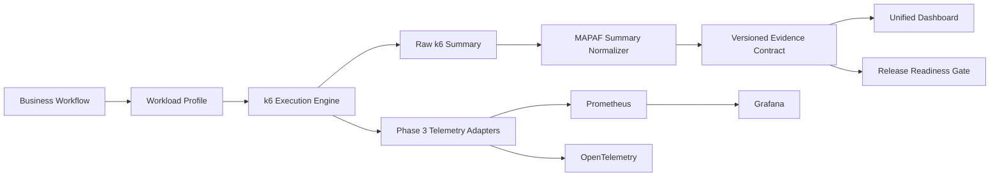

# MAPAF v3.0 k6 Performance Platform Architecture

## Objective

Make k6 the default MAPAF performance execution engine while retaining existing JMeter assets as an optional compatibility provider.

## Management boundaries

- `business/`: reusable business transactions.
- `workloads/`: smoke, load, spike, and exact-volume execution models.
- `thresholds/`: governed SLO and quality-gate rules.
- `profiles/`: environment and workload intent.
- `reporting/`: normalized execution evidence.
- `tests/`: deterministic contract validation.

## Compatibility

Existing tasks and scripts are preserved. The platform is additive and introduces a migration path instead of a forced replacement.
