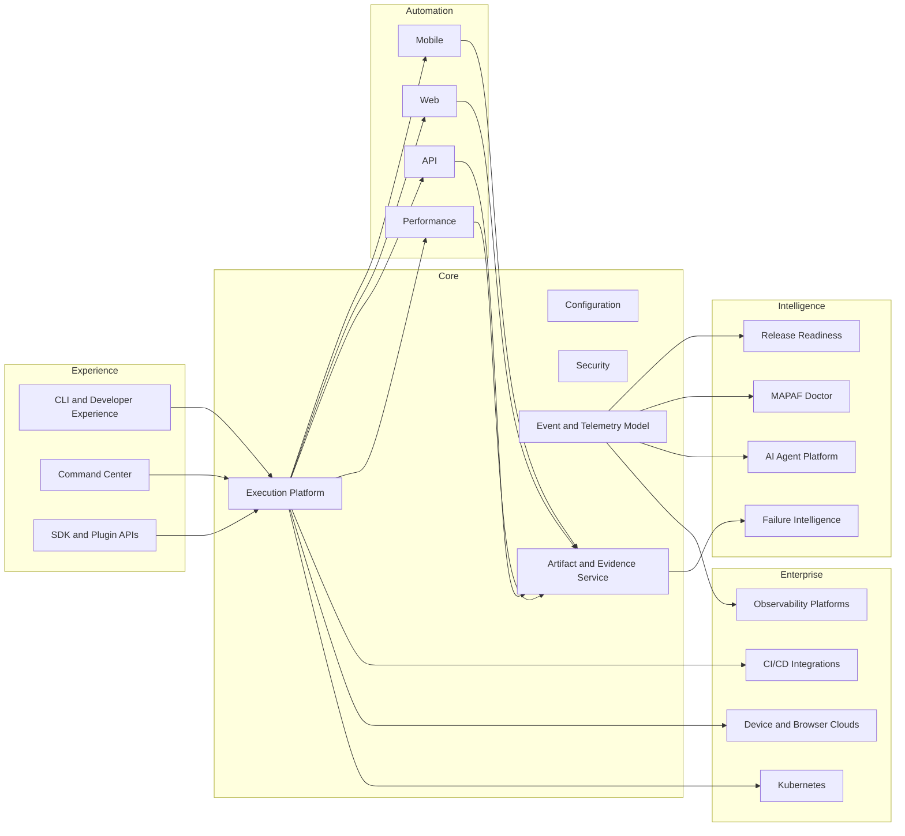
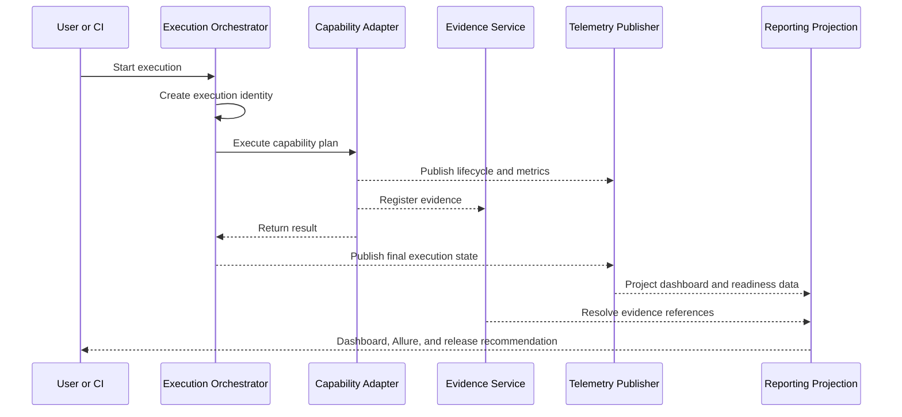

# MAPAF Enterprise Architecture Blueprint v1.0

## 1. Purpose
This blueprint is the governing architecture for MAPAF. It defines product boundaries, platform capabilities, domain ownership, dependency direction, extension contracts, non-functional requirements, and release governance.

## 2. Architecture Goals
- Scale from local developer execution to enterprise distributed execution.
- Support mobile, web, API, and performance testing through common platform contracts.
- Preserve tool-specific depth without fragmenting the product model.
- Support evidence, failure intelligence, release readiness, diagnostics, and AI governance.
- Enable future enterprise integrations without coupling the core to vendors.

## 3. Capability Map

## 4. Bounded Contexts

### Platform Core
Owns execution identity, lifecycle, configuration, extension discovery, security context, and common telemetry contracts.

### Automation Capabilities
Owns tool-specific adapters and orchestration for Mobile, Web, API, and Performance. Capabilities may not redefine core execution concepts.

### Evidence and Reporting
Owns artifact registration, evidence metadata, report generation, dashboard projections, and Allure publication.

### Failure Intelligence
Owns failure classification, evidence correlation, root-cause hypotheses, confidence, and remediation recommendations.

### Release Readiness
Owns quality gates, risk aggregation, AI readiness, business readiness, and executive recommendation.

### Diagnostics
Owns Claude, device, browser, API, dashboard, performance, and environment health validation.

### Enterprise Integrations
Owns provider adapters for BrowserStack, Sauce Labs, CI/CD, Kubernetes, and observability systems.

### AI Platform
Owns agent control plane, skill packs, provider abstraction, prompt and agent versioning, evaluation, audit, confidence, and human approval.

## 5. Core Domain Model

| Aggregate | Responsibility |
|---|---|
| Execution | End-to-end run identity and lifecycle |
| Suite | Collection of tests executed under one intent |
| Test | Verifiable scenario |
| Step | Atomic execution activity |
| BusinessTransaction | Business-facing workflow measurement |
| Evidence | Typed artifact with provenance and retention metadata |
| Failure | Structured failure event |
| Recommendation | Actionable platform or AI recommendation |
| Risk | Normalized risk assessment |
| QualityGate | Deterministic release criterion |
| Environment | Runtime target and configuration fingerprint |
| Agent | Governed AI worker identity and version |
| Integration | External provider binding and health state |

## 6. Dependency Rules
1. Product modules depend on platform contracts, not on sibling implementations.
2. Dashboard and reporting consume published contracts; they do not inspect test internals.
3. Vendor integrations are adapters behind provider-neutral interfaces.
4. AI may recommend or enrich; deterministic execution remains authoritative unless a human-approved policy says otherwise.
5. Evidence paths are never hard-coded into consumers; they are published as references.

## 7. Runtime Architecture

## 8. Reporting Contract Direction
The current v2.7 summaries remain supported. A future versioned contract will introduce:
- schemaVersion
- execution metadata
- timeline
- business transactions
- evidence references
- failures
- metrics
- recommendations

Migration must be additive first, with adapters for legacy summaries.

## 9. Security Architecture
- Secrets must never be written to reports or logs.
- Headers and payload fields require policy-based masking.
- Integrations use external secret stores or CI secret injection.
- Agent actions require audit records and explicit approval policies.
- Evidence access must support future authorization and retention controls.

## 10. Observability Architecture
Every execution publishes:
- executionId, correlationId, and traceId
- lifecycle events
- structured metrics
- evidence metadata
- health state
- failures and recommendations

OpenTelemetry is the strategic telemetry standard for v3.0; current logging remains supported through adapters.

## 11. Extension Model
MAPAF will expose provider-neutral SPIs for:
- execution capabilities
- evidence publishers
- report renderers
- device and browser providers
- CI/CD connectors
- observability exporters
- AI providers, agents, and skills

## 12. Release Alignment
- v2.7: Allure Showcase and complete evidence experience
- v2.8: Release Readiness
- v2.9: MAPAF Doctor
- v3.0: Enterprise Integrations
- v4.0: AI Platform

## 13. Architecture Quality Attributes
- Availability: graceful degradation when optional providers are unavailable
- Portability: local, CI, container, and Kubernetes execution
- Scalability: parallel and distributed execution without shared mutable state
- Maintainability: clear boundaries and stable contracts
- Auditability: traceable decisions, evidence, and AI actions
- Security: least privilege, masking, and secret isolation
- Testability: contract, unit, integration, and release validation layers

## 14. Definition of Architectural Compliance
A feature is compliant only when it has:
- documented ownership and bounded context
- stable contract or adapter boundary
- observability and failure behavior
- unit and integration coverage
- architecture decision record where material
- release and migration notes
