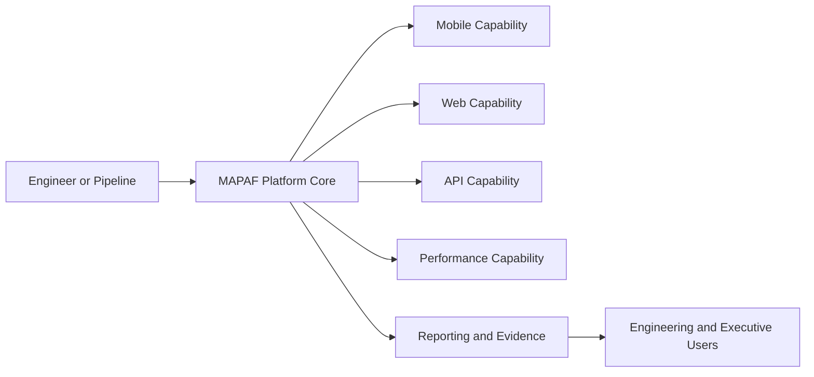
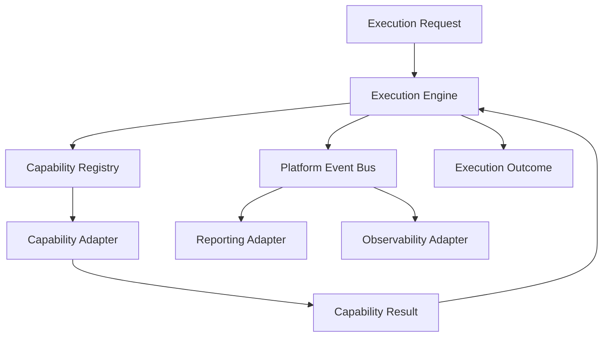
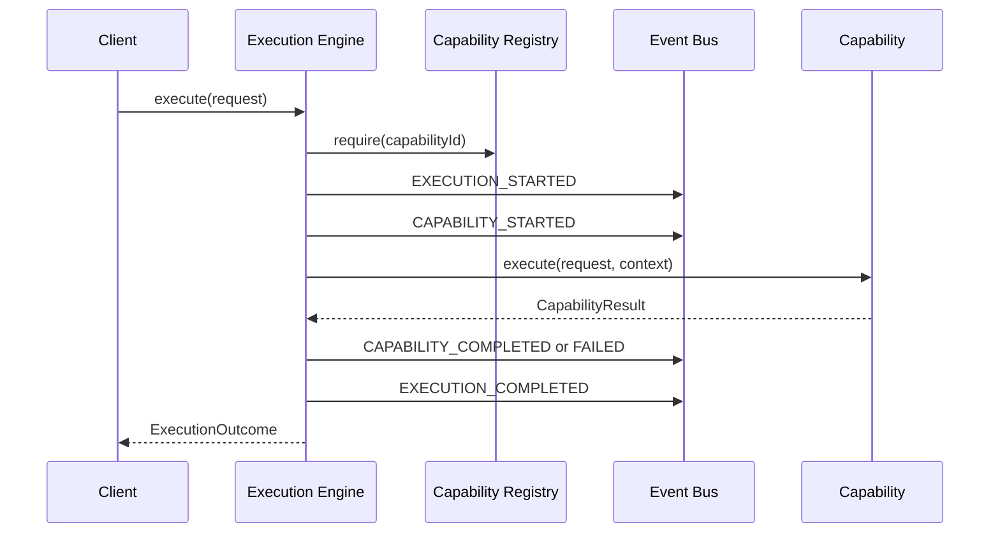
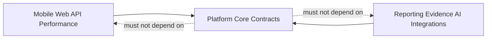

# MAPAF Platform Core Diagrams

## Context

```mermaid
flowchart LR
  User[Engineer or Pipeline] --> Core[MAPAF Platform Core]
  Core --> Mobile[Mobile Capability]
  Core --> Web[Web Capability]
  Core --> API[API Capability]
  Core --> Perf[Performance Capability]
  Core --> Reporting[Reporting and Evidence]
  Reporting --> Stakeholder[Engineering and Executive Users]
```

## Container view

```mermaid
flowchart TB
  Request[Execution Request] --> Engine[Execution Engine]
  Engine --> Registry[Capability Registry]
  Registry --> Capability[Capability Adapter]
  Engine --> EventBus[Platform Event Bus]
  Capability --> Result[Capability Result]
  Result --> Engine
  EventBus --> Reporting[Reporting Adapter]
  EventBus --> Telemetry[Observability Adapter]
  Engine --> Outcome[Execution Outcome]
```

## Execution sequence

```mermaid
sequenceDiagram
  participant C as Client
  participant E as Execution Engine
  participant R as Capability Registry
  participant B as Event Bus
  participant P as Capability
  C->>E: execute(request)
  E->>R: require(capabilityId)
  E->>B: EXECUTION_STARTED
  E->>B: CAPABILITY_STARTED
  E->>P: execute(request, context)
  P-->>E: CapabilityResult
  E->>B: CAPABILITY_COMPLETED or FAILED
  E->>B: EXECUTION_COMPLETED
  E-->>C: ExecutionOutcome
```

## Dependency direction

```mermaid
flowchart LR
  Modules[Mobile Web API Performance] --> Contracts[Platform Core Contracts]
  Adapters[Reporting Evidence AI Integrations] --> Contracts
  Contracts -. must not depend on .-> Modules
  Contracts -. must not depend on .-> Adapters
```
